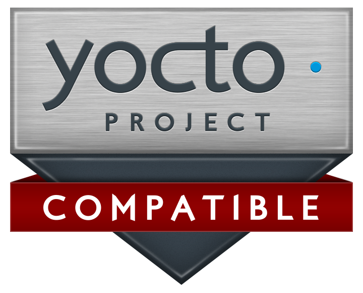

# meta-raspberrypi

Yocto BSP layer for the Raspberry Pi boards - <http://www.raspberrypi.org/>.

[](https://meta-raspberrypi.readthedocs.io/en/latest/?badge=latest)
[](https://matrix.to/#/#meta-raspberrypi:matrix.org)

<table border="0" rules="none">
<tr border="0">
<td width="140" height="100" align="center">
  <br />
  <a href="https://www.yoctoproject.org/ecosystem/branding/">
    
  </a>
</td>
<td width="150" height="100" align="center">
  Sponsored by:<br />
  <a href="https://balena.io">
    
  </a>
</td>
</tr>
</table>

## Quick links

* Git repository web frontend:
  <https://github.com/agherzan/meta-raspberrypi>
* Mailing list (yocto mailing list): <yocto@lists.yoctoproject.org>
* Issues management (Github Issues):
  <https://github.com/agherzan/meta-raspberrypi/issues>
* Documentation: <http://meta-raspberrypi.readthedocs.io/en/latest/>

## Description

This is the general hardware specific BSP overlay for the RaspberryPi device.

More information can be found at: <http://www.raspberrypi.org/> (Official Site)

The core BSP part of meta-raspberrypi should work with different
OpenEmbedded/Yocto distributions and layer stacks, such as:

* Distro-less (only with OE-Core).
* Yoe Disto (Video and Camera Products).
* Yocto/Poky (main focus of testing).

## Yocto Project Compatible Layer

This layer is officially approved as part of the `Yocto Project Compatible
Layers Program`. You can find details of that on the official Yocto Project
[website](https://www.yoctoproject.org/development/yocto-project-compatible-layers/).

## Dependencies

This layer depends on:
* URI: https://git.openembedded.org/bitbake
  * branch: master
  * revision: HEAD

* URI: https://git.openembedded.org/openembedded-core
  * branch: master
  * revision: HEAD

* URI: https://git.yoctoproject.org/meta-yocto
  * branch: master
  * revision: HEAD

## Quick Start

1. source openembedded-core/oe-init-build-env rpi-build
2. Add this layer to bblayers.conf and the dependencies above
3. Set MACHINE in local.conf to one of the supported boards
4. bitbake core-image-base
5. Use bmaptool to copy the generated .wic.bz2 file to the SD card
6. Boot your RPI

## Quick Start with kas

1. Install the kas build tool from PyPI:

   ```
   pip3 install kas
   ```

2. Select the appropriate machine configuration file from `kas/`
   (for example `raspberrypi4.yml`, `raspberrypi3-64.yml`, etc.)

3. Run the build:

   ```
   kas build meta-raspberrypi/kas/<machine>.yml
   ```

4. Use `bmaptool` to copy the generated `.wic.bz2` image to the SD card

5. Boot your Raspberry Pi

The kas configuration is split into a shared `base.yml` and per-machine
configuration files. Machine selection is done by choosing the appropriate
kas file rather than editing a `machine` variable.

To adjust the build configuration with specific options (I2C, SPI, etc.),
extend the configuration by adding a `local_conf_header` section, for example:

```
local_conf_header:
  rpi-specific: |
    ENABLE_I2C = "1"
    RPI_EXTRA_CONFIG = "dtoverlay=disable-bt"
```

Additional configurations can be layered by including extra kas files. For example,
to enable runtime testing with `testimage`:

```
kas build meta-raspberrypi/kas/raspberrypi4.yml:meta-raspberrypi/kas/testimage.yml
```

For further details, see the kas documentation:
https://kas.readthedocs.io/en/latest/index.html


## Contributing

You can send patches using the GitHub pull request process or/and through the
Yocto mailing list. Refer to the
[documentation](https://meta-raspberrypi.readthedocs.io/en/latest/contributing.html)
for more information.

## Maintainers

* Andrei Gherzan `<andrei at gherzan.com>`
